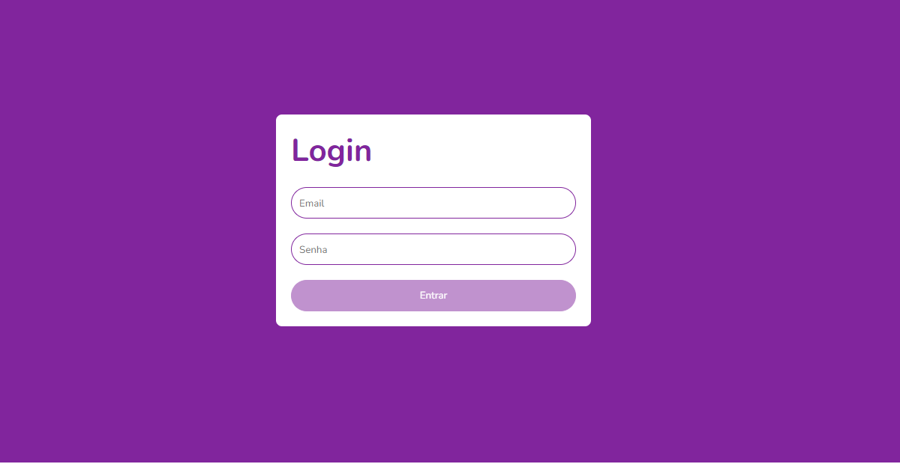

# Desafio Dio - Implementando Uma Tela de Login Com Validação Usando TypeScript


Projeto para implementar uma tela de login com validação usando TypeScript:


1. #### Crie um novo projeto React usando o seguinte comando:

```plaintext
npx create-react-app login
```


1. #### Abra o arquivo `src/App.js` e adicione o seguinte código:


```plaintext
import React, { useState } from "react";
import ReactDOM from "react-dom";
import { BrowserRouter as Router, Route, Switch } from "react-router-dom";
import LoginForm from "./components/LoginForm";

const App = () => {
  const [formData, setFormData] = useState({});

  return (
    <Router>
      <Switch>
        <Route path="/" exact={true}>
          <LoginForm formData={formData} setFormData={setFormData} />
        </Route>
      </Switch>
    </Router>
  );
};

export default App;
```


1. #### Crie o arquivo `src/components/LoginForm.js` e adicione o seguinte código:


```plaintext
import React, { useState, useEffect } from "react";
import { Formik, Form } from "react-hook-form";
import * as yup from "yup";
import { Field, ErrorMessage } from "formik";

const schema = yup.object().shape({
  email: yup.string().email().required(),
  senha: yup.string().required().minLength(6),
});

const LoginForm = ({ formData, setFormData }) => {
  const [errors, setErrors] = useState({});

  useEffect(() => {
    // Limpar os erros do formulário
    setErrors({});
  }, [formData]);

  const onSubmit = (values) => {
    // Validar os dados do formulário
    const validationErrors = schema.validate(values);

    // Se houver erros de validação, mostrá-los
    if (validationErrors) {
      setErrors(validationErrors);
    } else {
      // Realizar a ação desejada
    }
  };

  return (
    <Form onSubmit={onSubmit}>
      <Field name="email" label="Email" type="email" />
      <Field name="senha" label="Senha" type="password" />
      <ErrorMessage name="email" />
      <ErrorMessage name="senha" />
      <button>Entrar</button>
    </Form>
  );
};

export default LoginForm;
```


1. #### Inicie o servidor de desenvolvimento usando o seguinte comando:

```plaintext
npm start
```


1. #### Abra o navegador e acesse `http://localhost:3000/` para visualizar o projeto.

Este projeto é apenas um exemplo básico de como implementar uma tela de login com validação usando TypeScript. Pode-se adicionar mais funcionalidades, como a validação de e-mail em tempo real, conforme necessário.


# Projeto Login

Esta aplicação foi utilizada no Bootcamp Orange Tech+ para aplicar os conceitos sobre validação, uso do Yup, react-hook-form e TypeScript.


## Tarefa

- Mudar o botão para habilitado ou desabilitado de acordo com a validação do formulário de login.

  

- ## Alterações

- Adição da propriedade `opacity` do botão caso o botão esteja desabilitado

- Alteração do estilo ao passar com o mouse por cima do botão, as propriedades `box-shadow` e `border` estão substituindo a propriedade `opacity`.


<h1 align="center">
  
</h1>


# 
